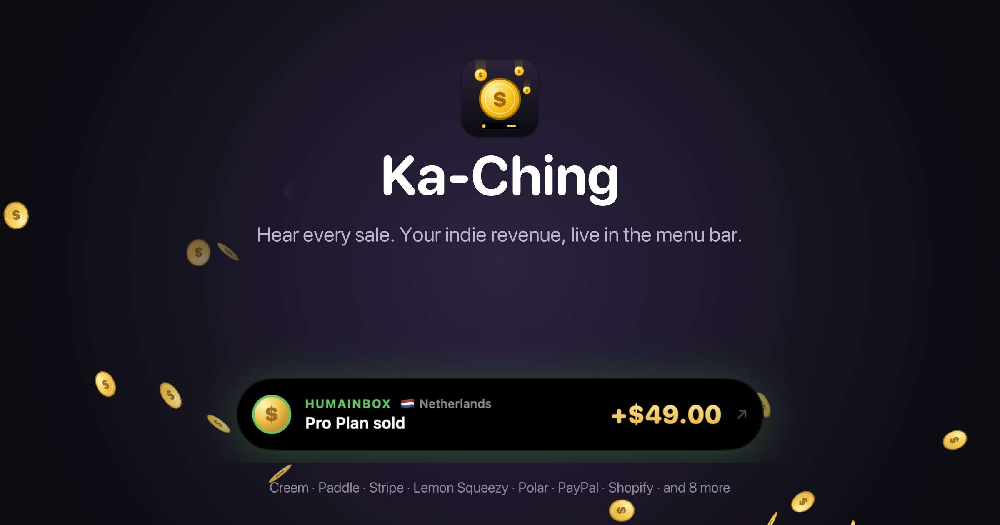
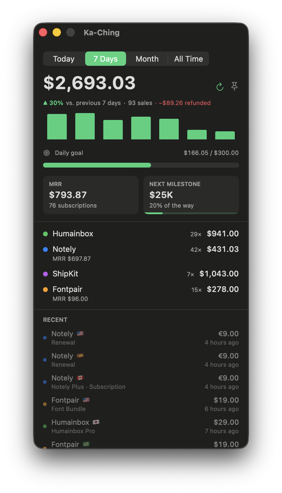
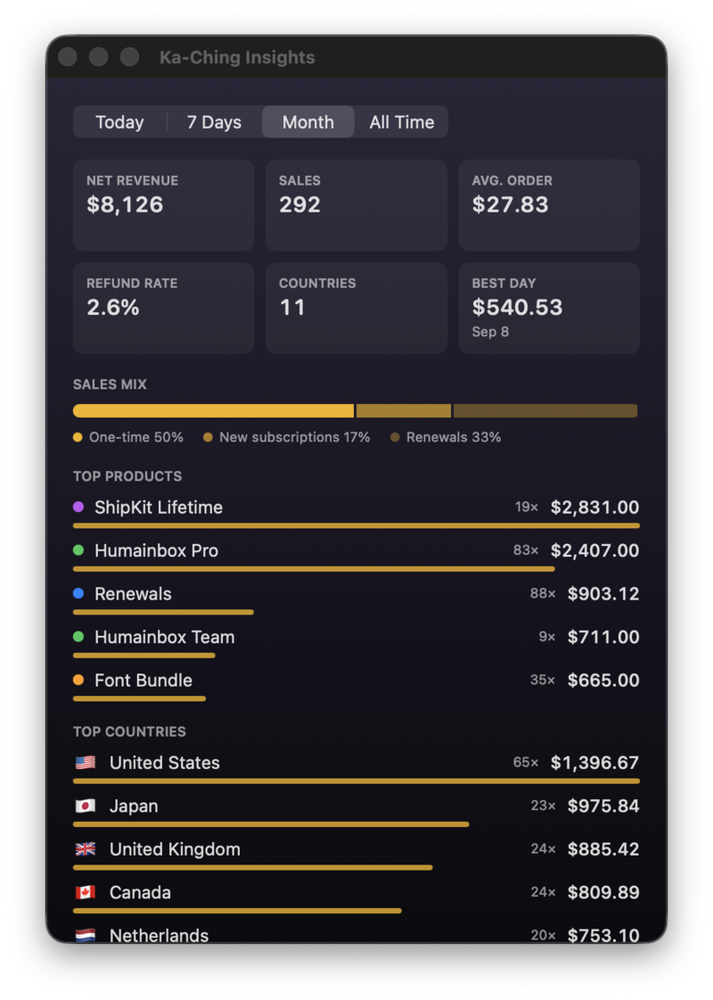
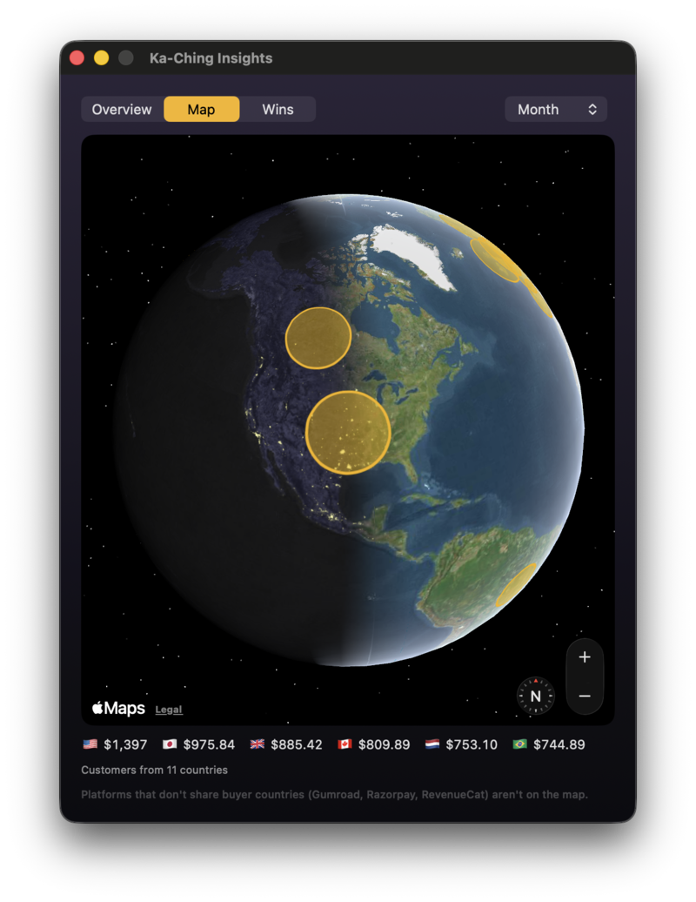
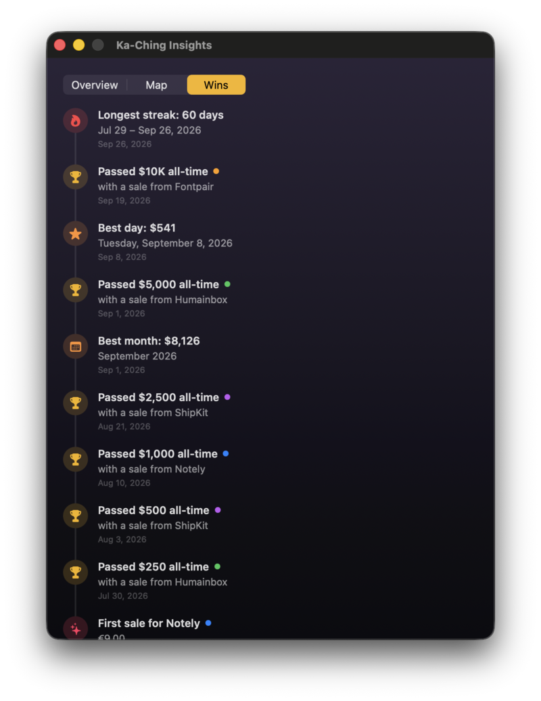
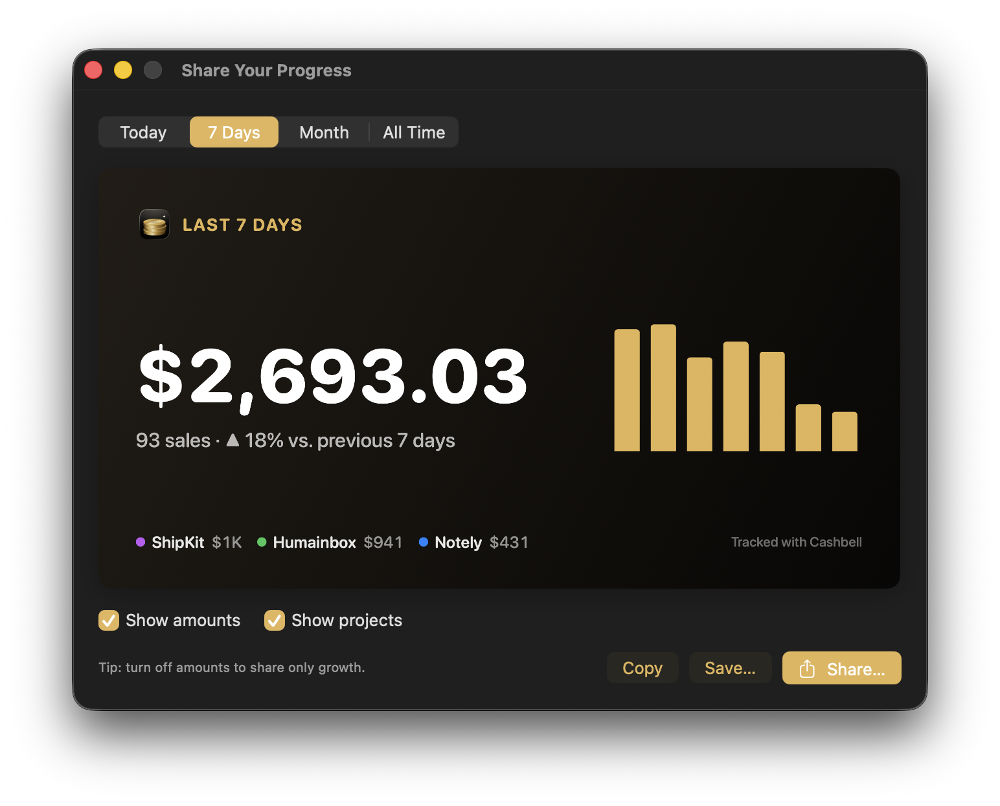

  

<h3 align="center">Hear every sale. Your indie revenue, live in the menu bar.</h3>

  <a href="https://github.com/yergunes/ka-ching-releases/releases/latest"><b>⬇&nbsp;Download for macOS</b></a>
  &nbsp;·&nbsp; macOS 14 or later &nbsp;·&nbsp; Apple Silicon &amp; Intel

---

Ka-Ching is a tiny macOS menu bar app for indie makers who sell on **Creem, Paddle, Stripe, Lemon Squeezy, Polar, Dodo Payments, PayPal, Shopify, WooCommerce, Gumroad, Whop, Mollie, Square, Razorpay, Chargebee and RevenueCat**. Add your projects once. From then on, every new sale rains gold coins down your screen, pops up a Dynamic Island–style pill with what sold and where, and plays a satisfying *ka-ching*.

No server, no account, no spreadsheet refreshing. Just the sound of your side projects paying off.

## What it does

**💰 Live totals in the menu bar.** Today, 7 days, this month or all time, converted to your currency and net of refunds. Or show MRR, ARR, active subscriptions, or just the icon. Double-click the icon to open the dashboard in a window.

**📊 Every project at a glance.** Revenue, sales count and MRR per project, plus a trend against the previous period and a chart you can hover.

**🪙 Celebrations you can feel.** Coin rain with a subtle 3D tumble on every display, a sale island on the screen you're working on, and a cha-ching. One switch mutes them all.

**🎯 Goals, milestones and streaks.** Set a daily goal and the menu bar icon becomes a ring that fills through the day. Crossing $1K, $10K and beyond gets a fanfare, and so does a project's very first sale. Sell every day and a 🔥 streak shows up.

**↩️ Refund alerts.** Refunds and chargebacks show up as a red island, so nothing slips by.

**🔁 MRR and subscriptions.** Active subscriptions and monthly recurring revenue across your stores.

**🌍 Where it came from.** Each sale shows the buyer's country. Click the island to open the payment in your dashboard.

**🤫 Privacy Mode.** One click at the bottom of the menu hides every amount and pauses celebrations, then recaps what you missed when you turn it off. It also switches on by itself while you're in a call or sharing your screen, and "Show anyway" is one click when you *do* want to show off.

**🪟 Detachable dashboard.** Press <kbd>⌥</kbd><kbd>⌘</kbd><kbd>K</kbd> from anywhere to open it in a window, and pin it on top like a widget.

**🔔 Weekly and daily summaries.** A Monday-morning notification with last week's revenue, the change and your top project. Daily summaries are one switch away.

**⬆️ Updates itself.** When a new version is out, a dot appears on the menu bar icon and a banner at the top of the menu and Settings. One click installs it in place, and your projects and history stay put.

 

## Make it yours

- **Themes.** Lacquer (black and gold, the default), System, Midnight, Forest, Ocean, Graphite or Paper, plus any accent color you like. Settings follows your theme too.
- **Menu bar icon.** A dollar coin, a coin stack, a bell, a banknote, a crown or a chart. Or no icon at all, just the number.
- **Project logos.** Drop in a logo and it shows up in the menu, the sale island and your recent sales.
- **A sound and a rain per project.** Pick cha-ching, coin drop, bell, chime or arcade, and rain gold or silver coins, dollar bills, gems, stars, confetti, or your own logo minted into a gold coin. Preview them right from Settings.
- **Your order.** Drag projects into the order you want to see them.

## Insights

The numbers behind the totals, for today, 7 days, this month or all time:

- Net revenue, sales, **average order** and **refund rate**
- **Sales mix:** one-time vs. new subscriptions vs. renewals
- **Top products** and **top countries**
- Your **best day** and the hour people buy the most

Open it from the chart button in the menu. Two more tabs sit next to the overview.

 

### Customer map

See where your customers are on a 3D globe, with day and night drawn live. Every country you sell to gets a glowing bubble sized by revenue. The globe opens over your biggest market, and the top markets are listed underneath: click one to spin the globe there.

 

### Wall of Wins

A timeline of the moments worth remembering: your first sale and each project's first sale, every milestone from $250 to $10K and beyond, your best day and best month, the biggest single sale and your longest sales streak. It's built from your sales history, so it's full from the moment you connect a store.

 

## Share your progress

  

Building in public? Turn any period into a ready-to-post 1200×630 card for X or LinkedIn. Copy, save or share it in one click. Rather keep revenue private? Switch off **Show amounts** and the card shows only your growth and sale count.

## Install

1. [Download the latest DMG](https://github.com/yergunes/ka-ching-releases/releases/latest) and drag **Ka-Ching** into Applications.
2. Open it. Ka-Ching lives in your **menu bar**: look for the <b>$</b> icon at the top right.
3. Click the icon, then **Settings… → Add Project**, and paste an API key.

> **Can't see the icon?** On MacBooks with a camera notch, a full menu bar hides icons behind it. Open Ka-Ching again from Applications (or press <kbd>⌥</kbd><kbd>⌘</kbd><kbd>K</kbd>) and the dashboard opens in a window. Also check **System Settings → Menu Bar**.

The app is signed and notarized by Apple, so it opens without security warnings.

## Connecting your stores

Add one project per store. Read-only keys are all Ka-Ching needs: it never creates, changes or refunds anything.

| Platform | Where to get the key | Tip |
|---|---|---|
| **Merchant of Record** | | |
| Creem | Dashboard → Developers → API Keys | Each store has its own key. |
| Paddle (Billing) | Developer Tools → Authentication | Read access to transactions, subscriptions and adjustments. |
| Lemon Squeezy | Settings → API | One key covers all your stores. Add a Store ID to track just one. |
| Polar | Settings → Developers → New token | Give it `orders:read` and `subscriptions:read` (`disputes:read` optional). |
| Dodo Payments | Developer → API Keys | Use a test-mode key for test mode. |
| **Payments** | | |
| Stripe | Developers → API keys | Best: a restricted key with *Charges* and *Subscriptions* set to Read. |
| PayPal | developer.paypal.com → Apps & Credentials → REST app | Enable *Transaction Search*, then paste Client ID and Secret. PayPal lists transactions up to ~3 hours late. |
| Square | Developer Console → your app → Credentials | Production (or Sandbox) access token. Several locations? Add a Location ID. |
| Mollie | Dashboard → Developers → API keys | `live_` for real payments, `test_` for test mode. |
| Razorpay | Account & Settings → API Keys | Paste Key ID and Key Secret. Razorpay doesn't expose buyer countries. |
| **Commerce & creators** | | |
| Shopify | Dev Dashboard → create an app with `read_orders` | Install it on your store, then paste Client ID and secret (a legacy `shpat_` token works too). Add `read_all_orders` for history older than 60 days. |
| WooCommerce | WooCommerce → Settings → Advanced → REST API | A key with Read permission, plus your store URL. |
| Gumroad | Settings → Advanced → Applications → Generate access token | Gumroad doesn't expose countries or MRR. |
| Whop | Developer → API keys | A company key with `payment:basic:read`. |
| **Subscription billing** | | |
| Chargebee | Settings → Configure Chargebee → API Keys | A read-only key, plus your site name (the part before `.chargebee.com`). |
| **In-app purchases** | | |
| RevenueCat | Project settings → API keys → New secret key (v2) | Read access to *Charts & metrics*, plus your Project ID. App Store and Google Play sales arrive as a running daily total (no product names or countries), with MRR and active subscriptions. |

Test mode works too: Creem, Paddle, Polar, Dodo Payments, PayPal and Square have a sandbox switch; the others follow the key you paste.

## Privacy

- **Your data stays on your Mac.** Ka-Ching talks directly to your payment providers. There is no Ka-Ching server, account, analytics or tracking.
- **API keys live in the macOS Keychain**, never in plain files.
- **The only other network calls** are daily exchange rates from [Frankfurter](https://frankfurter.dev) (ECB data) and a daily update check against this repository.

## FAQ

**How real-time is it?**
Ka-Ching checks every minute by default (30 seconds to 10 minutes in Settings). A new sale shows up within one check.

**Will it hit my API rate limits?**
No. After a one-time history import, each check costs a single request per project (two on Paddle and Lemon Squeezy), and it backs off automatically if a provider says slow down.

**I have several products on the same platform.**
Add each store as its own project, with its own color. Lemon Squeezy can split one account into several projects by Store ID.

**Different currencies?**
Totals are converted to the currency you choose (USD, EUR, GBP or TRY) using daily ECB rates. Individual sales keep their original currency.

**Can I turn the coins off during focus time?**
Yes. The switch at the bottom of the menu mutes coin rain, island and sound together. The animations, displays and sounds can also be tuned one by one in Settings.

## Release notes

See [Releases](https://github.com/yergunes/ka-ching-releases/releases) for what's new in each version.

---

  Made with ☕ and too many side projects by <b>Sedat Yusuf Ergüneş</b> 
  © 2026 Reaktör Teknoloji · Updates by <a href="https://sparkle-project.org">Sparkle</a> · Exchange rates by <a href="https://frankfurter.dev">Frankfurter</a>

